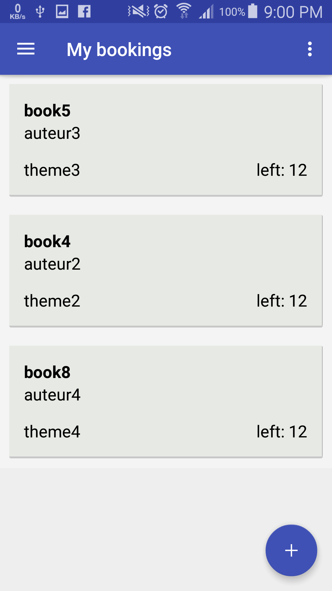

# Library-Android-Application

This is an android application I made for the university I studied in, it contains all the books available in the university's library and you can book a book from the application.

## Built With

- Android Studio
- XML
- Java

## Author

👤 **Mirouhml**

- GitHub: [@mirouhml](https://github.com/mirouhml)
- LinkedIn: [LinkedIn](https://www.linkedin.com/in/ammar-hamlaoui-514909189/)
- Twitter: [@kuronomirou](https://twitter.com/kuronomirou)

## 🤝 Contributing

Contributions, issues, and feature requests are welcome!

Feel free to check the [issues page](../../issues/).

## Show your support

Give a ⭐️ if you like this project!

## 📝 License

This project is [MIT](./MIT.md) licensed.
